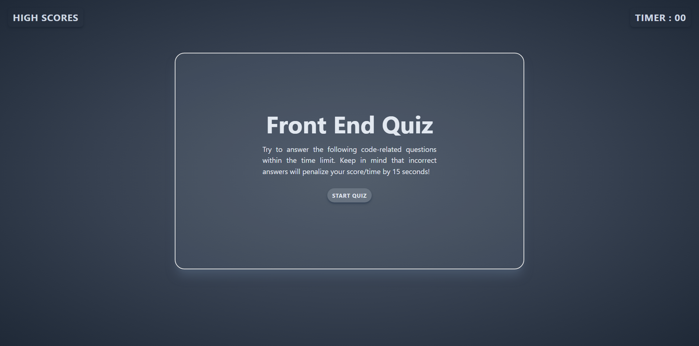

# frontend-101

## TailwindCSS

For this web application I set the goal for myself to learn, understand and implement Tailwind CSS framework to be able to build a well desgined responsive application.

I was able to use npm to install TailwindCSS into my project and debug problems when compiling my tailwindcss input file into the css style.

## JavaScript

I used pseudocode to break down this application into smaller applications.

I used each line of pseudocode to create a function and avoid repetition.

I had to understand how I can manipulate the DOM through methods to be able to change the classes created by TailwindCSS

## HTML

I was able to get my hands on multiple HTML interactions, as well as working with tailwindcss and manage classes usage to style the HTML file.

## Screenshot of my Quiz App

